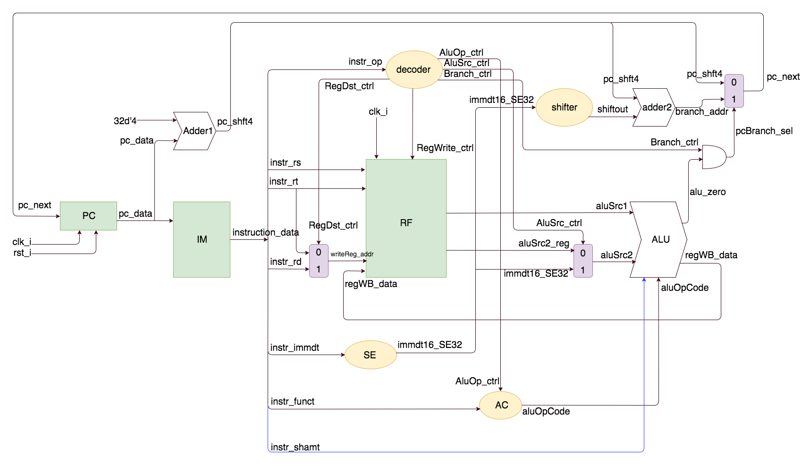
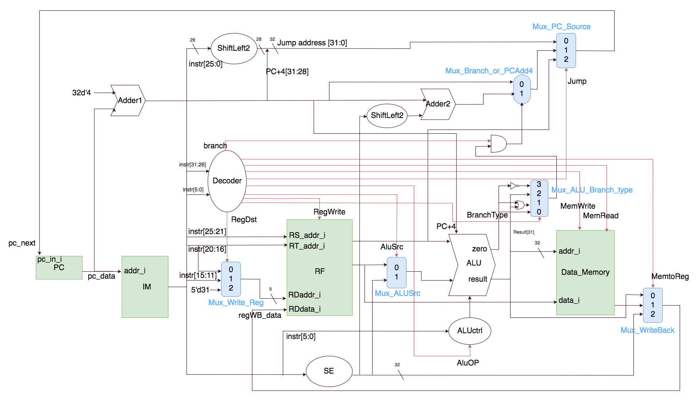
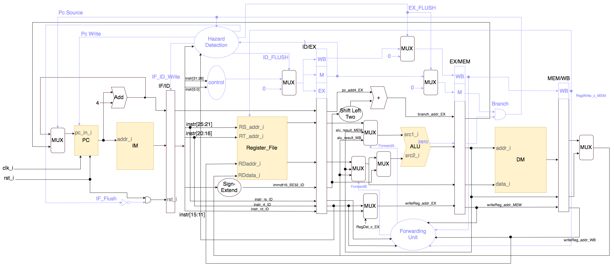

# ComputerOrganization_2017Spring

For undergraduate course Computer Organization in NCTU,2017 Spring 

only including codes for laboratory section 

# Lab1 - ALU
use `32 bit ripple carry adder`as the funfdamantal part to build up the ALU

# Lab2 - Single Cycle CPU
implemented a single clock cycle cpu with `arithmetic operation` & `branch`

# Lab3 - Single Cycle CPU with Memory
build an CPU capable of R/W with memory and additionaly,implemented `Jump`&`Jump return` instructions

# Lab4 - 5-stage Pipelined CPU
implementing a simple version 5-stage pipelined CPU, with `forwarding`& `branch pridiction` mechanisim

# Lab5 - Cache Simulator

Simulate cache behaviors by C/C++ style cache simulators to understand
the performance difference between different cache architectures.